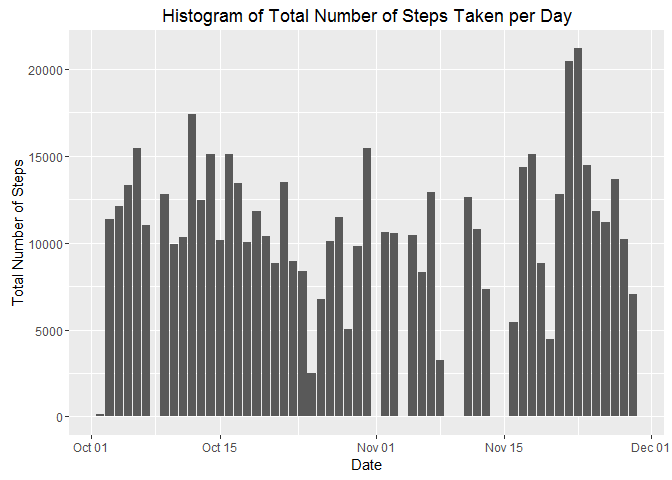
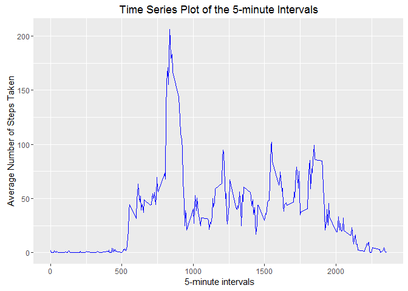
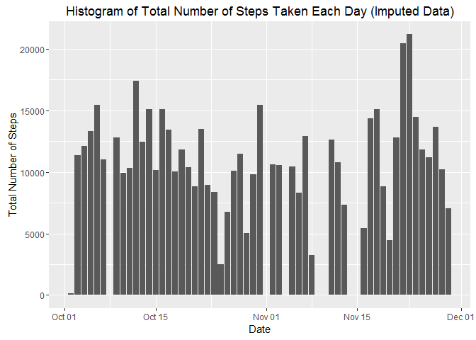
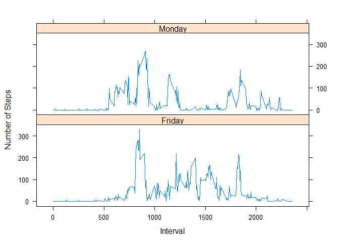
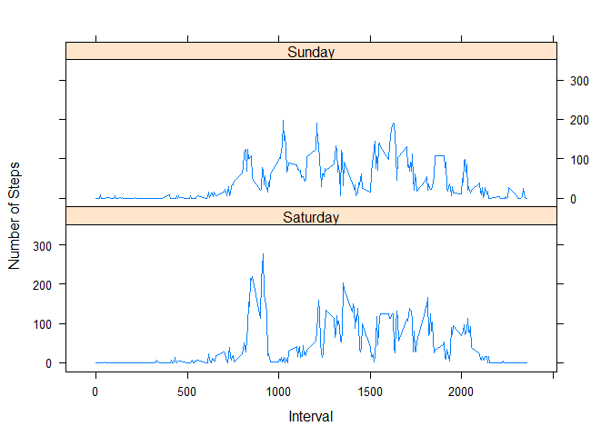
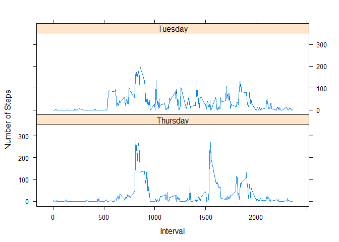
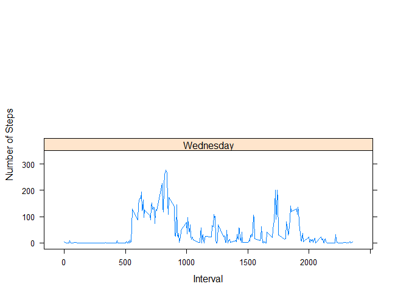

# PA1_template
Matt Zapf  
June 24, 2016  


```r
knitr::opts_chunk$set(echo = TRUE)
```

```
#Reproducible Research -Peer Assessment 1
This is an R Markdown document for peer assessment 1 of Coursera's Reproducible Research course.


Load packages
```


```r
library(ggplot2)
```

```
## Warning: package 'ggplot2' was built under R version 3.2.5
```
```
Load and process the data
```

```r
data<-read.table('activity.csv',sep= ",",header=TRUE, na.strings ="NA", colClasses = c('integer','Date','factor'))
```
```
Remove rows with NA
```

```r
data2<-na.omit(data)
```
```
### What is the mean total number of steps taken per day?
```

```r
totalsteps<-tapply(data2$steps,data2$date,FUN=sum)
plot<-ggplot(data2, aes(date,steps)) + geom_bar(stat="identity")+
  labs(title ="Histogram of Total Number of Steps Taken per Day",x="Date", y ="Total Number of Steps")
print(plot)
```

<!-- -->
```
Mean total number of steps per day:
```


```r
mean(totalsteps)
```

```
## [1] 10766.19
```
```
Median total number of steps per day :
```

```r
median(totalsteps)
```

```
## [1] 10765
```
```
###What is the average daily activity pattern?
```

```r
average<-aggregate(data2$steps,list(interval = as.numeric(as.character(data2$interval))), FUN = "mean")
names(average)[2]<-"Avg.Steps"


plot2<-ggplot(average,aes(interval,Avg.Steps)) +geom_line(color="blue", size = 0.7) + labs(title = "Time Series Plot of the 5-minute Intervals", x=" 5-minute intervals",y="Average Number of Steps Taken")
print(plot2)
```

<!-- -->
```
Which 5-minute interval, on average across all days, contains the most steps?
```

```r
average[average$Avg.Steps==max(average$Avg.Steps),]
```

```
##     interval Avg.Steps
## 104      835  206.1698
```
```
Total numer of incomplete cases
```

```r
sum(!complete.cases(data))
```

```
## [1] 2304
```
```
Imputing missing values by using mean for that 5-minute interval.
```

```r
imputeddata<-data2
for (i in 1:nrow(imputeddata)){
     if (is.na(imputeddata$steps[i])){
         imputeddata$steps[i] <- average[which(imputeddata$interval[i]== average$interval),]$Avg.Steps
     }
}
```
```
Check that all the missing values have been filled in.
```


```r
sum(!complete.cases(imputeddata))
```

```
## [1] 0
```
```
Histogram of total number of stepes taken each day following missing value imputation.
````

```r
plot3<-ggplot(imputeddata,aes(date,steps)) +geom_bar(stat ="identity") + labs(title ="Histogram of Total Number of Steps Taken Each Day (Imputed Data)",x ="Date",y="Total Number of Steps")
print(plot3)

totalstepsimputed<-tapply(imputeddata$steps,imputeddata$date,FUN =sum)
mean(totalstepsimputed)
```

```
## [1] 10766.19
```

<!-- -->
```
Median total number of steps takeng per day imputed dataset
```

```r
median(totalstepsimputed)
```

```
## [1] 10765
```
```
Compare means and medians : both means are the same while the new median is greater than the old median.

Create factor variables for date being weekday or weekend.
```

```r
imputeddata$weekdays<-factor(format(imputeddata$date,"%A"))
levels(imputeddata$weekdays)
```

```
## [1] "Friday"    "Monday"    "Saturday"  "Sunday"    "Thursday"  "Tuesday"  
## [7] "Wednesday"
```


```r
levels(imputeddata)<-list(weekday= c("Monday","Tuesday","Wednesday","Thursday","Friday"),
                          weekend=c("Saturday","Sunday"))
levels(imputeddata$weekdays)
```

```
## [1] "Friday"    "Monday"    "Saturday"  "Sunday"    "Thursday"  "Tuesday"  
## [7] "Wednesday"
```

```r
table(imputeddata$weekdays)
```

```
## 
##    Friday    Monday  Saturday    Sunday  Thursday   Tuesday Wednesday 
##      2016      2016      2016      2016      2304      2592      2304
```
```
Graphing panel plots containing time series plot of each 5-minute interval and the average number of steps taken, averaged across all days, split into weekdays and weekends.
```

```r
newaverage<-aggregate(imputeddata$steps,
                      list(interval = as.numeric(as.character(imputeddata$interval)),
                      weekdays = imputeddata$weekdays),
                      FUN ="mean")
names(newaverage)[3]<-"MeanofSteps"
library(lattice)
plot4<-xyplot(newaverage$MeanofSteps ~ newaverage$interval| newaverage$weekdays,
            layout =c(1,2),type ="l",
            xlab ="Interval", ylab = "Number of Steps")
print(plot4)
```



